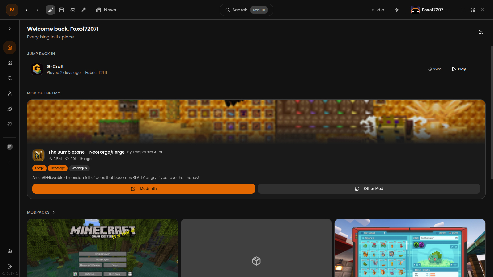
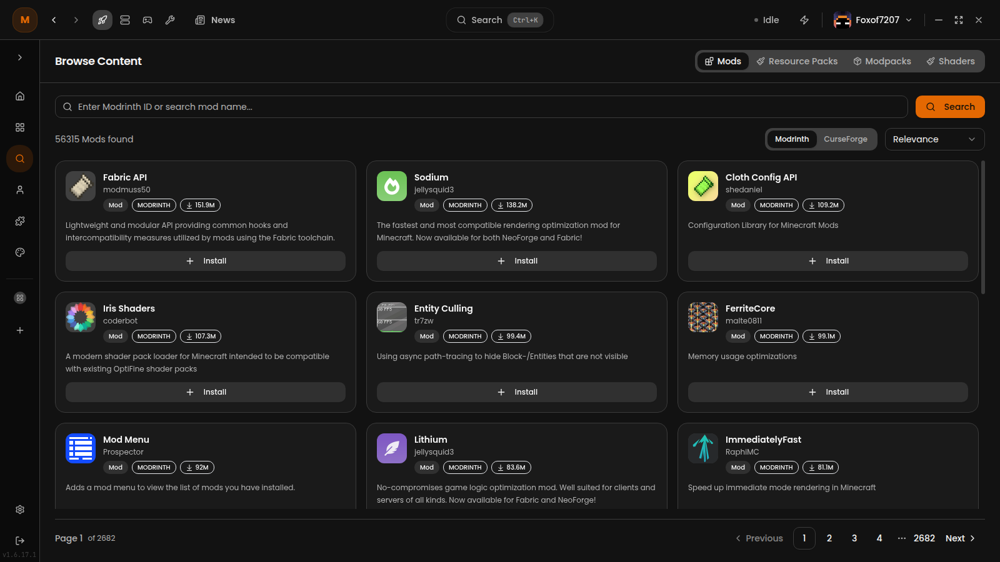
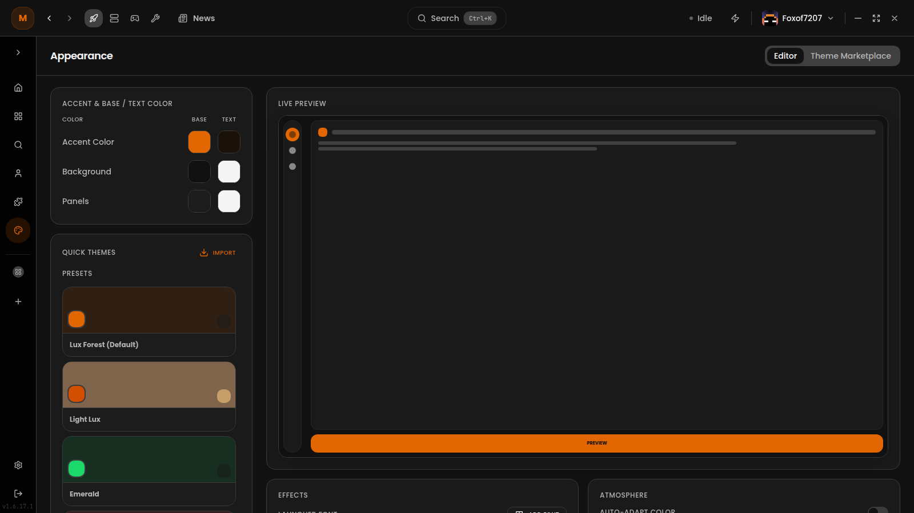
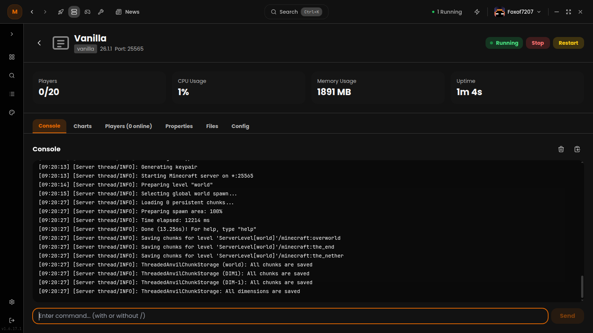

<div align="center">

  

  <h1><strong>Lux</strong></h1>

  <p>
    <em>
      A modern Minecraft launcher built with <b>Electron</b>, <b>React</b>, and <b>Tailwind CSS</b>.<br />
      Manage instances, servers, skins, modpacks, and themes — all in one place.
    </em>
  </p>

  <div>
    <a href="https://github.com/Lux-Client/LuxClient/actions/workflows/build-appimage.yml">
      
    </a>
    <a href="https://github.com/Lux-Client/LuxClient/actions/workflows/build-deb.yml">
      
    </a>
    <a href="https://github.com/Lux-Client/LuxClient/actions/workflows/build-rpm.yml">
      
    </a>
    <a href="https://github.com/Lux-Client/LuxClient/actions/workflows/build-win.yml">
      
    </a>
    <a href="https://github.com/Lux-Client/LuxClient/actions/workflows/scan.yml">
      
    </a>
    <a href="https://github.com/Lux-Client/LuxClient/releases">
      
    </a>
  </div>

</div>

---

## Features

### Instance & Modpack Management
- **Multi-loader launch** — Vanilla, Fabric, Forge, NeoForge, Quilt
- **Modrinth & CurseForge** — Browse and import modpacks directly from both platforms
- **Sorting & Grouping** — Sort instances by name, version, or playtime; group by version or loader

### Server Management
- **Full server lifecycle** — Create, configure, start, and stop Minecraft servers from within the launcher
- **Server console** — Live console output with log analysis and crash detection
- **Server software** — Browse and install Paper, Purpur, Fabric, and more

### Tools & Client Mode
- **Client Mode** — Launch the vanilla client directly with custom configurations
- **Tools Dashboard** — Built-in utilities (log analyzer, resource pack tools, and more)

### Skin & Cape Viewer
- **Live 3D preview** — View your skin and cape in 3D using skinview3d
- **2D previews** — Head and body renders with lighting
- **Drag-and-drop** — Easily switch skins with file picker or drag-and-drop

### Customization
- **Theme system** — Full theme marketplace with community-created themes
- **Custom colors** — Per-component color picking with real-time preview
- **Command palette** — Quick actions with CMD+K palette

### Extensions
- **Extension support** — Load community extensions to extend launcher functionality
- **Extension marketplace** — Browse and install from within the app

### i18n
- **15 languages** — Fully localized UI with community-maintained translations

---

## Screenshots

<div align="center">
  
  
  
  
</div>

---

## Getting Started

### For Users

#### Quick Install
```bash
# Linux & macOS
curl -sSL https://lux.pluginhub.de/install.sh | bash

# Windows (PowerShell)
iwr https://lux.pluginhub.de/install.ps1 | iex
```

Or download the latest installer from the [releases page](https://github.com/Lux-Client/LuxClient/releases).

#### Supported Platforms
- **Linux** — AppImage, DEB, RPM
- **Windows** — NSIS installer (x64)
- **macOS** — DMG (Apple Silicon & Intel)

### For Developers

#### Prerequisites
- [Node.js](https://nodejs.org/) (latest LTS)
- npm or yarn

#### Setup
```bash
git clone https://github.com/Lux-Client/LuxClient.git
cd LuxClient
npm install
npm run dev
```

#### Scripts
| Command | Description |
|---|---|
| `npm run dev` | Start development server with hot reload |
| `npm run build` | Build the frontend |
| `npm run lint` | Lint all source files |
| `npm run typecheck` | Run TypeScript type checking |
| `npm run dist` | Build for production (platform-specific) |

---

## Architecture

```
electron/main.js       Electron main process (window, IPC, updates)
backend/handlers/      IPC handlers (auth, instances, servers, skins, ...)
src/                   React frontend
  pages/               Route components (Dashboard, Skins, Settings, ...)
  components/          Reusable UI components
  context/             React context providers
  locales/             15 translation files
  lib/                 Utilities and helpers
```

Built with **Vite** for fast builds, **Framer Motion** for animations, and **Radix UI** primitives for accessibility.

---

## Built With

- **Electron** — Desktop runtime
- **React** — UI framework
- **Vite** — Build tooling
- **Tailwind CSS** — Utility-first styling
- **Framer Motion** — Animations
- **Radix UI** — Accessible component primitives
- **skinview3d** — 3D Minecraft skin previews
- **i18next** — Internationalization (15 locales)
- **minecraft-launcher-core** — Java process management
- **electron-updater** — Auto-updates

---

## License

[PolyForm Shield License 1.0.0](LICENSE.md) — not an open-source license. See `LICENSE.md` for details.

---

<p align="center">
  Found a bug or need help?
  <a href="https://github.com/Lux-Client/LuxClient/issues/new">Open an issue</a>
  ·
  <a href="https://github.com/Lux-Client/LuxClient/discussions">Start a discussion</a>
</p>
